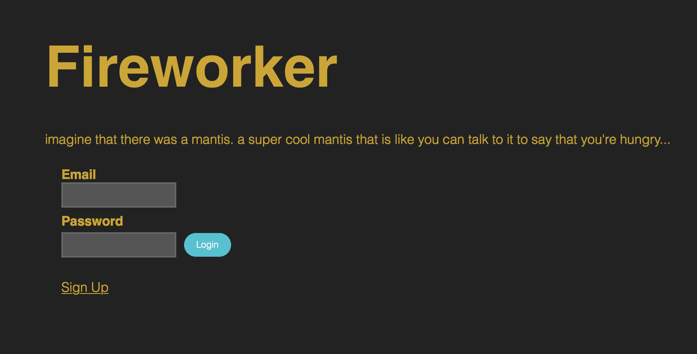
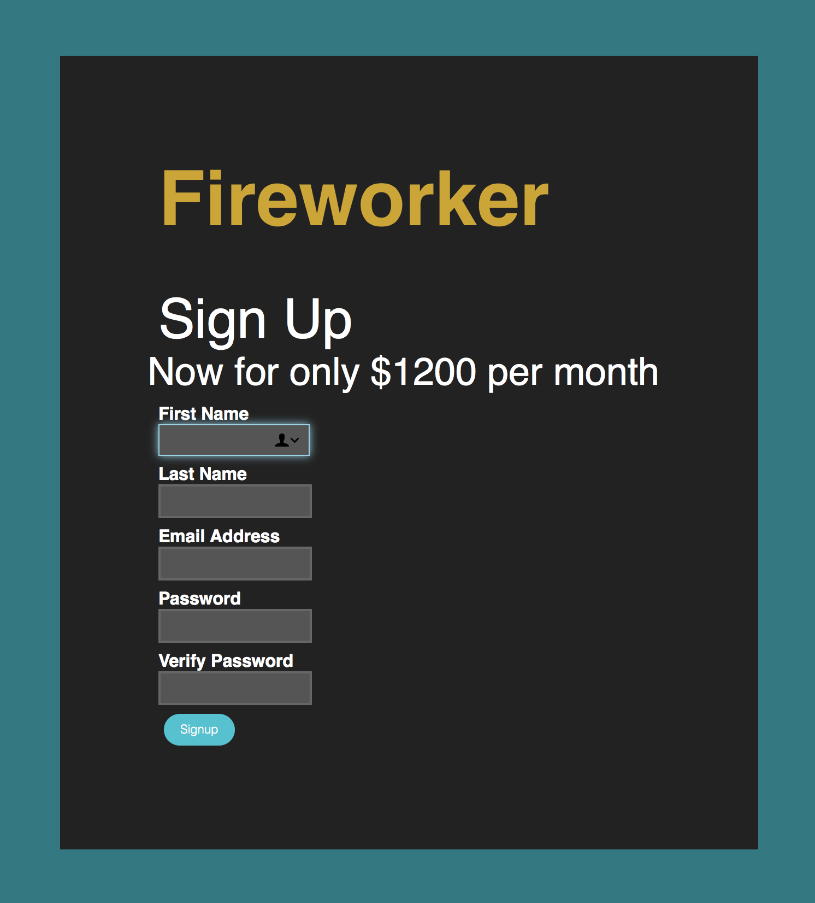
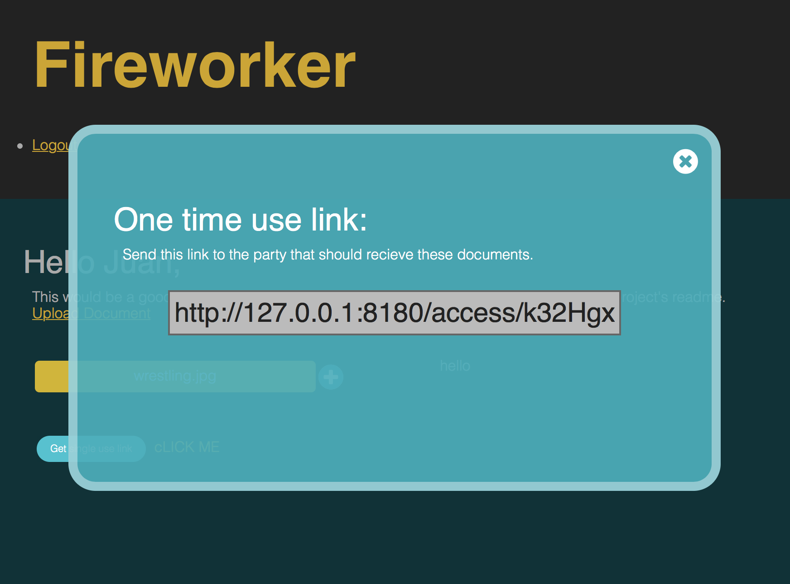

# Fireworker
### Version 1.0.5 Beta
[](https://travis-ci.org/JSitter/fireworker)
[](https://coveralls.io/github/JSitter/fireworker?branch=master)


## Introduction
Fireworker is a web app that will allow for the secure sending and retrieval of sensitive information. It was inspired by mission impossible and the self destructing message delivery by the fictional governments of Great Britain and the United States.

## Features
* Allows for users to share files with sensitive data such that they can only be downloaded once.
* Allows users to know that their sensitive files are transmitted around the world securely.

## Requirements
* Node version 7.0 or greater
* MongoDB

## Installation
Install fireworker on your server by running the terminal command:
```
npm install
```

To run fireworker first startup the mongodb daemon by running

``` 
sudo mongod 
``` 

then startup the server with the command 

``` 
npm start 
```

---






## Planned Features
* Text link to phone number
* Email verification option for sender

## Version 1.0.5
* Fixed db connection bug
* Added Materialize

## Version 1.0.1 Beta Updates and Bug Fixes
* Updated dependency version requirements.
* Attempting to re-create existing user re-directs to sign in page.
* Added testing architecture

## Bugs to fix 
* Check on page load if token user id exists in database
* Check that user can't submit record with no files selected


If fireworker doesn't initially work, try removing node_modules folder and reinstall by entering

```
    npm install
```
into the terminal.